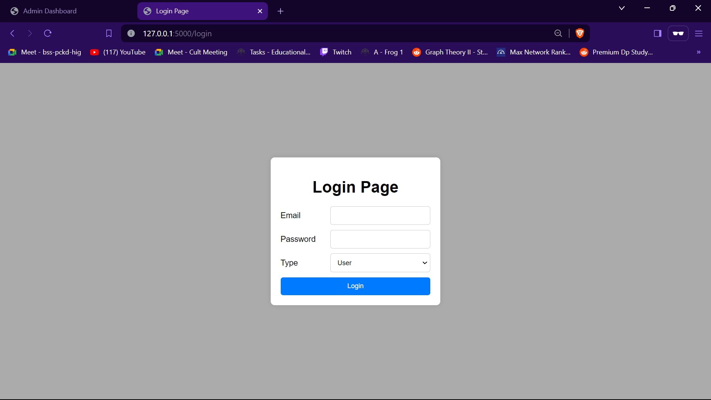
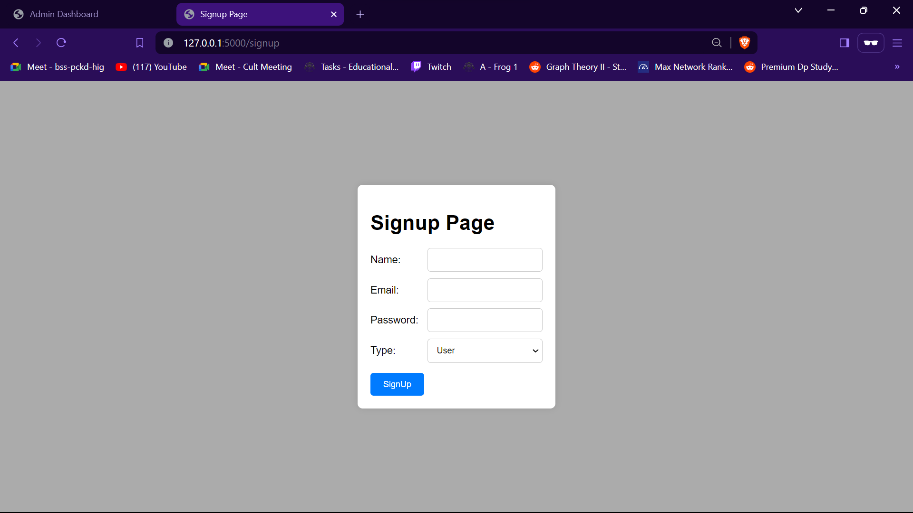
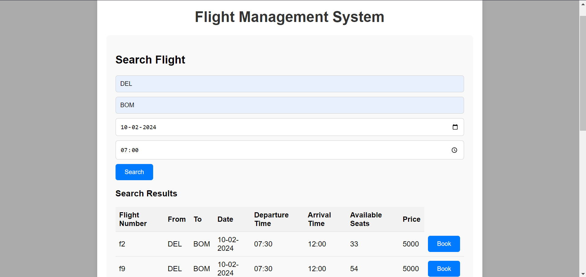
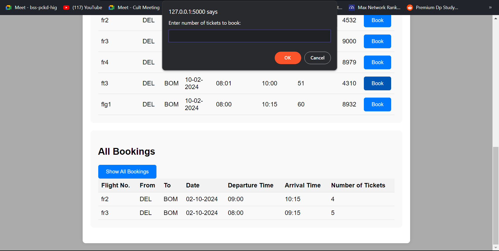
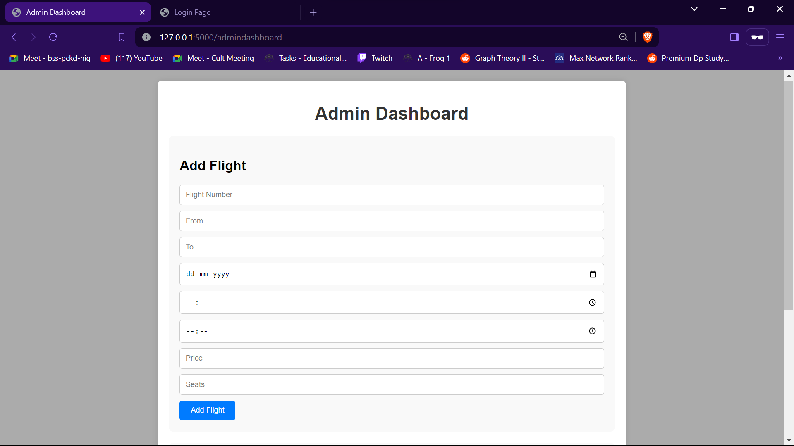
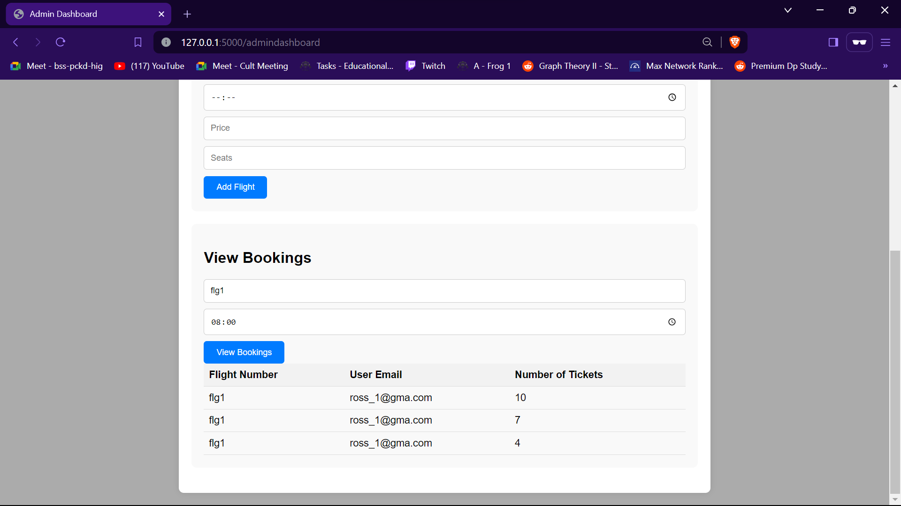
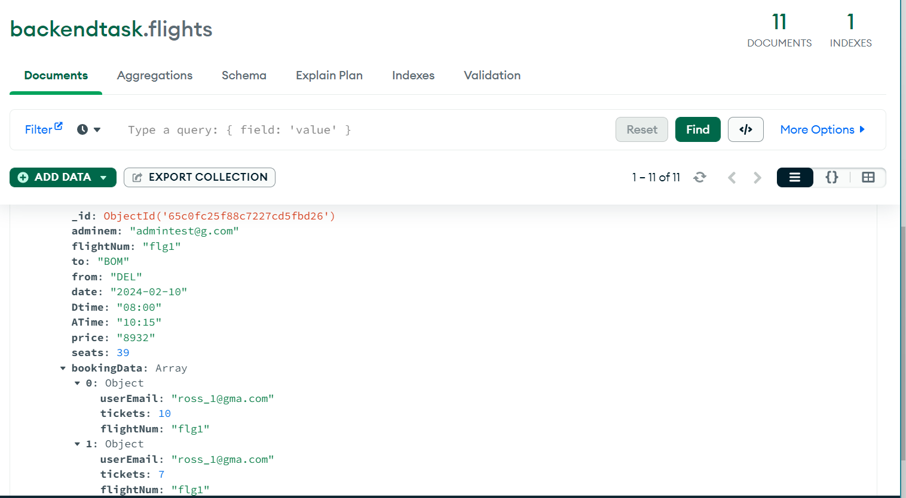
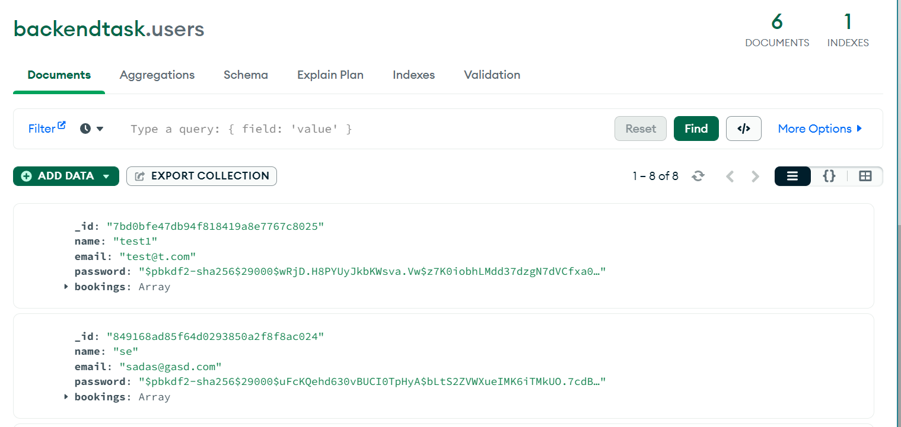
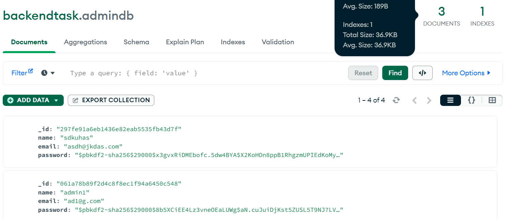

# Flight Management System

## Description
Flight Management System is a platform to manage the user and admin side of flight bookings. This project aims to make the flight booking simpler. The security has been kept
in mind and the password has been hashed and stored in database. Also cookies are being set on successfull login so as to make the system more efficient and simpler. The 
Frontend is also totally dynamic which responds on the basis of data given in input fields.

## Tech Stack
- Frontend: HTML/CSS/JS
- Backend: FLask
- Database: MongoDB

## Snapshots

